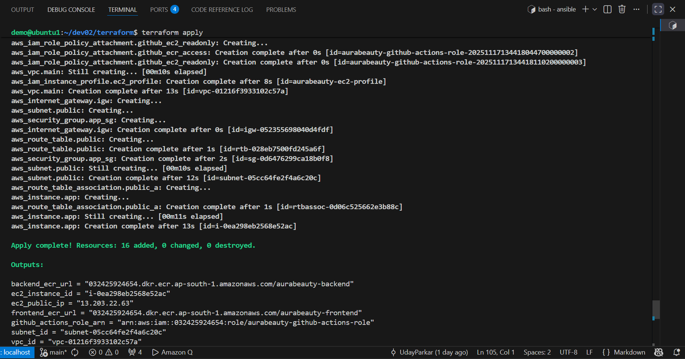
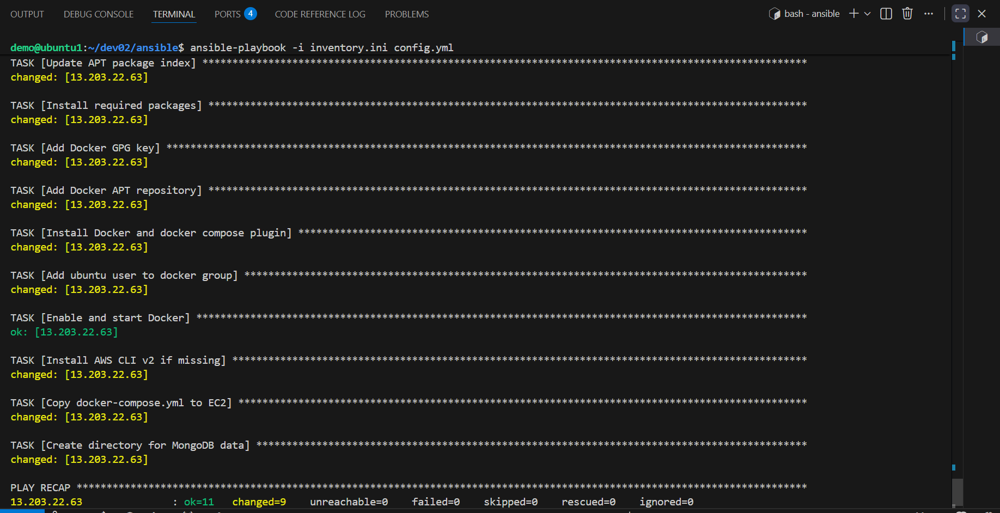
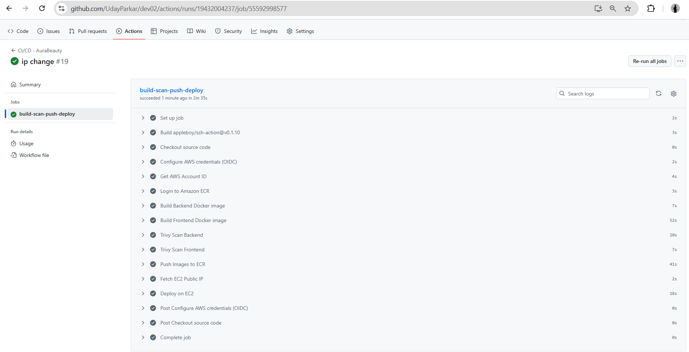
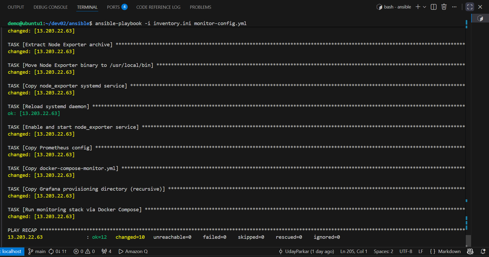
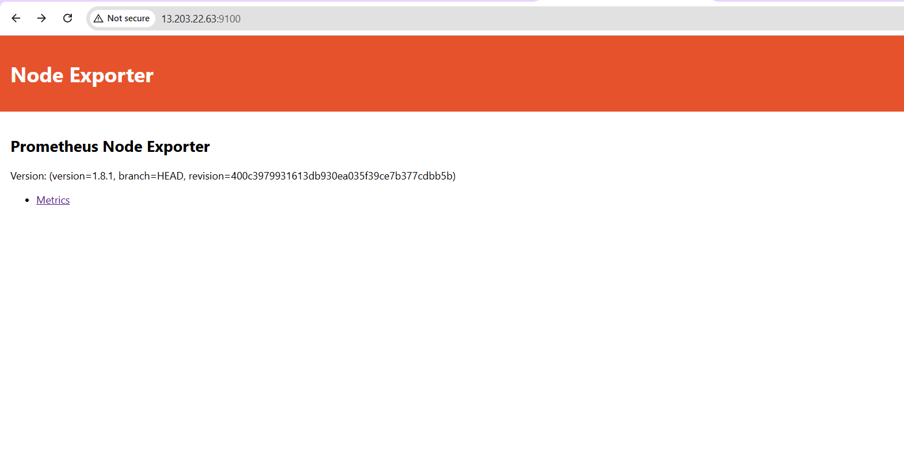
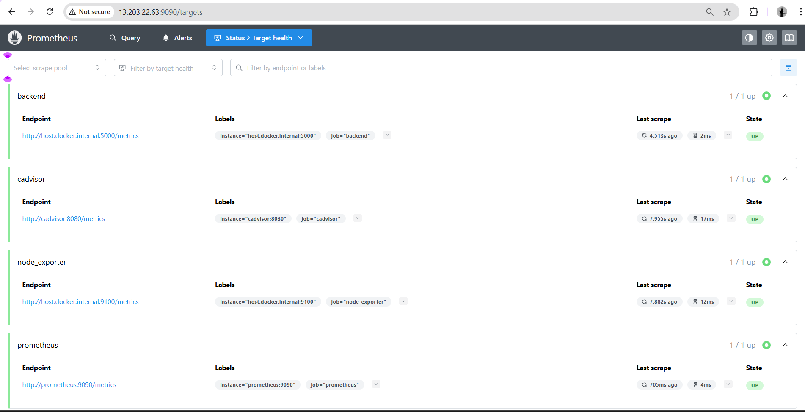
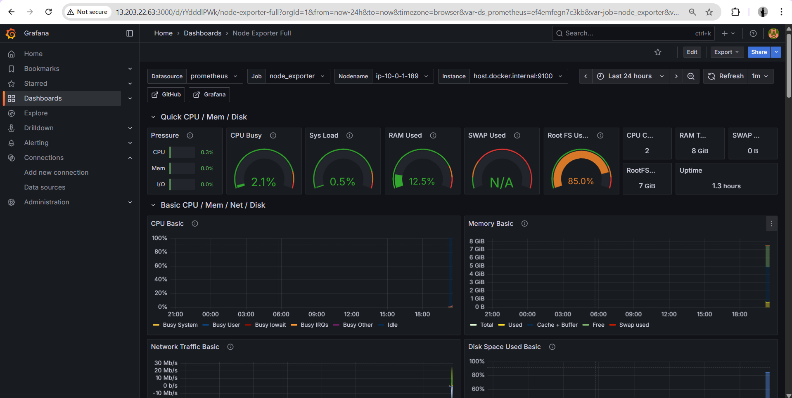
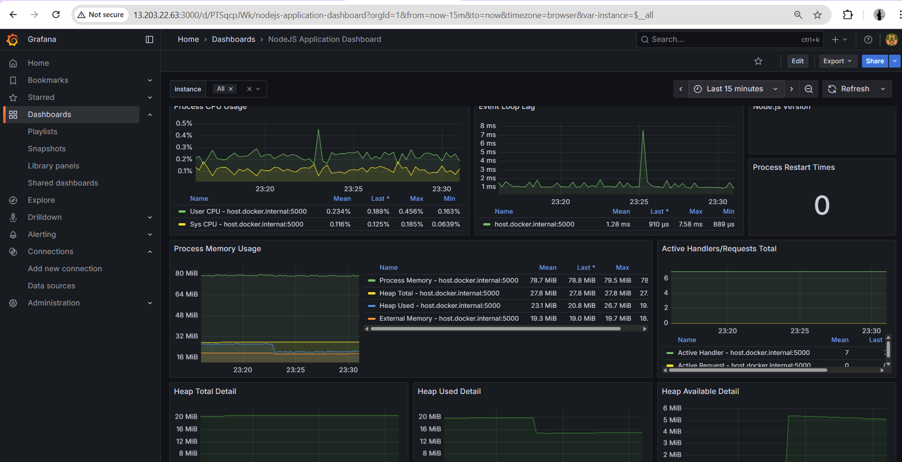

# AuraBeauty – End-to-End Deployment (Terraform • CI/CD • Monitoring)

---

## 📖 Overview

This project demonstrates a **complete production-style DevOps pipeline** for deploying a **3-tier application** (frontend + backend + MongoDB) using:

- **Terraform** – Infrastructure as Code (AWS VPC, EC2, Security Groups, IAM)
- **GitHub Actions** – CI/CD for building & pushing Docker images to ECR
- **Ansible** – Remote EC2 provisioning (Docker, AWS CLI, Monitoring stack, Node Exporter)
- **Docker Compose** – App deployment + Monitoring services
- **Prometheus + Grafana + Node Exporter** – Full observability stack

> **The deployment is fully automated from infrastructure → application → monitoring.**

---

## 📁 Project Structure

```
dev02/
├── ansible/
│   ├── config.yml                 # Installs Docker, AWS CLI, sets up app
│   ├── monitor-config.yml         # Installs Node Exporter + runs Prometheus, Grafana
│   └── inventory.ini
│
├── app/
│   ├── backend/
│   │   
│   └── frontend/
│
├── docker/
│   ├── frontend.Dockerfile
│   ├── backend.Dockerfile
│   └── nginx.conf                 # Frontend served via Nginx reverse proxy
│
├── monitoring/
│   ├── prometheus.yml
│   ├── docker-compose-monitor.yml
│   ├── node_exporter.service
│   └── graphana/
│       ├── provisioning/
│       │   ├── datasources/
│       │   │   └── datasource-prometheus.yaml
│       │   └── dashboards/
│       │       └── dashboards.yaml
│       └── dashboards/            # You manually import dashboards here
│
├── terraform/
│   ├── main.tf
│   ├── variables.tf
│   ├── outputs.tf
│   └── terraform.tfvars
│
├── docker-compose.yml             # Used ONLY for local dev testing
└── README.md                      # You are reading it
```

---

## 🚀 Part 1 — Infrastructure (Terraform on AWS)

### Terraform provisions:

| Component | Description |
|-----------|-------------|
| ✔ **VPC + Public Subnet** | Isolated network environment |
| ✔ **Internet Gateway + Route Table** | External connectivity |
| ✔ **Security Group** | Firewall rules for all services |
| ✔ **EC2 Instance** | Ubuntu 24.04 LTS |
| ✔ **IAM Role** | EC2 permissions to pull from ECR |
| ✔ **ECR Repositories** | Frontend + Backend image storage |
| ✔ **OIDC** | GitHub Actions CI/CD authentication |

#### Security Group Allows:

- `22` (SSH)
- `80` (Frontend)
- `5000` (Backend)
- `9090` (Prometheus)
- `3000` (Grafana)
- `9100` (Node Exporter)

### ▶️ Running Terraform

```bash
cd terraform
terraform init
terraform apply -auto-approve
```

**Output will include:**
- EC2 Public IP
- ECR repo URLs
- GitHub OIDC role
- VPC/Subnet details

**Screenshot Placeholder:**



---

## ⚙️ Part 2 — EC2 Configuration (Ansible)

Ansible playbook `config.yml` performs:

- ✔ Install Docker + Docker Compose Plugin
- ✔ Install AWS CLI v2
- ✔ Copy ansible/docker-compose.yml to EC2
- ✔ Prepare MongoDB data directory
- ✔ Allow ubuntu user to run docker
- ✔ Does NOT start the application (handled by CI/CD)

### Run:

```bash
cd ansible
ansible-playbook -i inventory.ini config.yml
```

Note: Ansible only prepares the EC2 instance and places the docker-compose.yml file. The actual application deployment (pulling images and starting containers) is handled entirely by the CI/CD pipeline.

**Screenshot Placeholder:**



---

## 🔄 Part 3 — CI/CD (GitHub Actions → ECR → EC2)

Whenever you push to `main`, GitHub Actions will:

1. 🔨 Build frontend Docker image
2. 🔨 Build backend Docker image
3. 🔐 scan frontend image with trivy
4. 🔐 scan backend image with trivy
5. 🔐 Login to AWS ECR using OIDC
6. 📤 Push both images to ECR
7. 🚀 SSH into EC2 and deploy the app.

**Screenshot Placeholder:**



---

## 📊 Part 4 — Monitoring Stack (Prometheus + Grafana + Node Exporter)

Monitoring stack is deployed via:

```bash
ansible-playbook -i inventory.ini monitor-config.yml
```

**Screenshot Placeholder:**



---

### This installs:

#### ✔ **Node Exporter**
System metrics from EC2 (CPU, RAM, Disk, Network)

**Screenshot:**



---

#### ✔ **Prometheus**
Scrapes:
- Prometheus itself
- Node Exporter
- Backend /metrics from prom-client

**Screenshot:**



---

#### ✔ **Grafana**
- Datasource autoprovisioned
- Dashboards imported manually:
  - Node Exporter Full (ID: 1860)
  - Backend/app level dashboard (ID: 11159)

**Grafana Dashboards:**





---

## 🌐 Part 5 — Application UI

**Screenshot Placeholder:**


### Services exposed publicly:

| Service | URL |
|---------|-----|
| **Frontend** | `http://<ec2-ip>:80` |
| **Backend** | `http://<ec2-ip>:5000` |
| **Prometheus** | `http://<ec2-ip>:9090` |
| **Grafana** | `http://<ec2-ip>:3000` |
| **Node Exporter** | `http://<ec2-ip>:9100/metrics` |

---

## ⚡ Local Development

There is a separate Docker Compose file for local testing:

```bash
docker-compose.yml
```

**Runs:**
- Mongo
- Backend (Node.js)
- Frontend (React)

All locally.

> **Note:** This file is NOT used in production.

---

## 🎯 Summary of Workflow

| Stage | Tool | Purpose |
|-------|------|---------|
| **Infrastructure** | Terraform | Provision AWS EC2 + VPC + SG + IAM + ECR |
| **Application Setup** | Docker Compose | Run 3-tier app |
| **CI/CD** | GitHub Actions | Auto-build & push images to ECR |
| **Config Management** | Ansible | Install Docker, AWS CLI, monitoring stack |
| **Monitoring** | Prometheus + Grafana | Full observability |
| **Metrics Export** | Node Exporter, prom-client | Host and App metrics |

---

## 🏁 Final Notes

✔ Fully automated end-to-end DevOps pipeline  
✔ App + Infra + Monitoring all deployed from scratch  
✔ CI/CD handles updates automatically  
✔ Monitoring stack provides real-time system + app metrics

---

<div align="center">

**Built with ❤️ for DevOps Excellence**

</div>